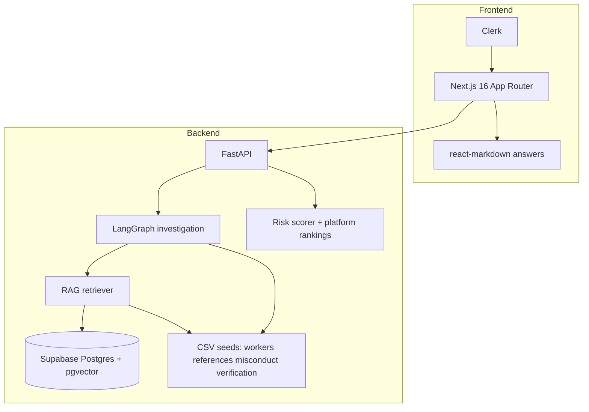

# SafeHire AI Risk Investigator

SafeHire AI Risk Investigator is an evidence-grounded decision-support platform for domestic-worker background checks, combining deterministic risk scoring with RAG and LLM reasoning to produce transparent, reviewable hiring insights.

Built with **OpenAI** (`gpt-4o-mini`, `text-embedding-3-small`), **LangGraph/LangChain**, **Supabase Postgres + pgvector**, **FastAPI**, **Next.js 16 + TypeScript**, **Clerk**, **Docker**, and **Vercel**.

> **Not legal advice.** Outputs support HR diligence only; validate policies, contracts, and local law before hiring decisions.

---

## Table of contents

- [Live deployment](#live-deployment)
- [Features](#features)
- [Architecture](#architecture)
- [Repository layout](#repository-layout)
- [Prerequisites](#prerequisites)
- [Quick start (local)](#quick-start-local)
- [Environment variables](#environment-variables)
- [Supabase: schema & ingest](#supabase-schema--ingest)
- [API surface](#api-surface)
- [Docker Compose](#docker-compose)
- [Testing](#testing)
- [Deployment](#deployment)
- [Operations & troubleshooting](#operations--troubleshooting)
- [License & status](#license--status)

---

## Live deployment

| | |
|---|---|
| **Production UI (Vercel)** | **[Investigation dashboard](https://safe-hire-ai-risk-investigator-i8fz.vercel.app/dashboard)** |

Sign in with **Clerk**. The frontend must have `NEXT_PUBLIC_API_BASE_URL` (or `NEXT_PUBLIC_API_URL`) set to your deployed API base path **including `/api`**; the backend should list this frontend origin in `CORS_ORIGINS`.

---

## Features

| Capability | Description |
|------------|-------------|
| **Per-worker investigation** | LangGraph pipeline: profile → retrieval → risk signals → sufficiency gate → markdown report. |
| **Deterministic risk score** | Same rule engine for investigations and cross-worker comparisons (`score_worker`), capped composite score with Low / Medium / High bands. |
| **Platform Q&A** | `POST /ask` **without** `worker_id`: cross-worker retrieval + optional `match_platform_documents` RPC; comparison questions (lowest risk, hire recommendation) use **rule-based rankings**, not only embeddings. |
| **Follow-up Q&A** | `POST /ask` **with** `worker_id`: worker-scoped evidence + risk snapshot; answers formatted as Markdown. |
| **Supabase RAG** | Per-worker `match_worker_documents`; optional global `match_platform_documents`. Falls back to per-worker RPC merge, then CSV keyword overlap. |
| **Auth** | Clerk on the Next.js app; API accepts `Authorization: Bearer` when the frontend sends Clerk tokens. |
| **Observability** | Optional LangSmith / LangChain tracing for pipeline and Q&A spans. |

---

## Architecture



| Layer | Role |
|--------|------|
| **Frontend** | Dashboard: **Ask the platform** (first), worker selector, run investigation, pipeline UI, risk cards, evidence, markdown report, follow-up Q&A. |
| **Backend** | FastAPI; routes mounted at **`/api/*`** and duplicated at **`/*`** for legacy/local clients (see `app/main.py`). |
| **Orchestration** | LangGraph: load → retrieve → signals → sufficiency → report branch. |
| **Retrieval** | OpenAI `text-embedding-3-small` (**1536** dimensions) — must match Postgres `vector(1536)` on `worker_documents.embedding`. |
| **Data** | Demo CSVs under `backend/app/data/`; production-like vector store in Supabase after ingest. |

---

## Repository layout

```text
.
├── backend/
│   ├── app/
│   │   ├── main.py              # FastAPI app, routers, CORS
│   │   ├── data/                # Seeded CSVs (workers, references, misconduct, …)
│   │   ├── orchestrator/        # LangGraph investigation
│   │   ├── rag/                 # Supabase client, ingest, retriever
│   │   ├── reports/             # followup_qa.py, platform_qa.py
│   │   └── risk/                # Deterministic scoring
│   ├── sql/                     # Postgres functions & DDL for Supabase
│   ├── tests/                   # pytest
│   ├── requirements.txt
│   ├── Dockerfile
│   └── .env.example
├── frontend/
│   ├── app/                     # Next.js App Router pages (dashboard, auth)
│   ├── components/              # PlatformAsk, FollowUpQA, MarkdownReport, …
│   ├── lib/api.ts               # API client (NEXT_PUBLIC_API_*)
│   └── Dockerfile
├── docker-compose.yml
├── vercel.json                  # Rewrites for serverless Python entry (if used)
└── README.md
```

---

## Prerequisites

| Tool | Notes |
|------|--------|
| **Python** | 3.12+ recommended (see `backend/Dockerfile`). |
| **Node.js** | 20+ recommended for Next.js 16. |
| **OpenAI API key** | Embeddings + optional LLM for signals, reports, and Q&A. |
| **Supabase project** | pgvector enabled; URL + anon/service key for RPC + ingest. |
| **Clerk application** | Publishable + secret keys for the frontend. |

---

## Quick start (local)

### Backend

```bash
cd backend
python -m venv .venv
source .venv/bin/activate          # Windows: .venv\Scripts\activate
pip install -r requirements.txt
cp .env.example .env               # then edit; add SUPABASE_* for vector search
uvicorn app.main:app --reload --host 0.0.0.0 --port 8000
```

- **Health:** `GET http://localhost:8000/health` or `GET http://localhost:8000/api/health`
- **OpenAPI docs:** `http://localhost:8000/docs` (same routes under `/api` where duplicated)

### Frontend

```bash
cd frontend
npm install
```

Create `frontend/.env.local`:

```bash
NEXT_PUBLIC_API_BASE_URL=http://localhost:8000/api
# or: NEXT_PUBLIC_API_URL=http://localhost:8000/api
NEXT_PUBLIC_CLERK_PUBLISHABLE_KEY=pk_test_...
```

```bash
npm run dev
```

Open `http://localhost:3000`, sign in, use **Ask the platform** and **Run risk assessment**.

---

## Environment variables

### Backend (`backend/.env`)

| Variable | Required | Purpose |
|----------|----------|---------|
| `OPENAI_API_KEY` | Yes (for full features) | Embeddings, signal extraction, reports, Q&A. |
| `SUPABASE_URL` | For RAG | Project URL only, e.g. `https://<ref>.supabase.co` — **no** `/rest/v1` suffix. |
| `SUPABASE_SERVICE_ROLE_KEY` | Recommended for backend ingest | Service-role key for server-side writes/RPC (bypasses RLS). |
| `SUPABASE_ANON_KEY` | For RAG | Anon key when policies allow required read/write RPC access. |
| `OPENAI_SIGNAL_MODEL` | No | Default `gpt-4o-mini`. |
| `OPENAI_ASK_MODEL` | No | Default `gpt-4o-mini` for `/ask` when LLM path is used. |
| `CORS_ORIGINS` | Production | Comma-separated browser origins; omit locally for permissive defaults. |
| `LANGSMITH_*` / `LANGCHAIN_*` | No | Tracing; see `backend/.env.example`. |

### Frontend (`frontend/.env.local`)

| Variable | Required | Purpose |
|----------|----------|---------|
| `NEXT_PUBLIC_API_BASE_URL` or `NEXT_PUBLIC_API_URL` | Yes | API origin including `/api` prefix, e.g. `http://localhost:8000/api`. |
| `NEXT_PUBLIC_CLERK_PUBLISHABLE_KEY` | Yes | Clerk publishable key. |
| `CLERK_SECRET_KEY` | Server-side | Set in hosting env for production builds (not prefixed with `NEXT_PUBLIC_`). |

### Docker

See [`.env.docker.example`](.env.docker.example) for `docker compose` variables (`NEXT_PUBLIC_API_URL`, Clerk, `OPENAI_API_KEY`).

---

## Supabase: schema & ingest

1. In Supabase: enable **pgvector**.
2. Run [`backend/sql/worker_documents.sql`](backend/sql/worker_documents.sql) — creates `worker_documents` and **`match_worker_documents`** RPC. Configure **RLS** so your key can `INSERT` / `DELETE` for ingest.
3. **Optional:** [`backend/sql/match_platform_documents.sql`](backend/sql/match_platform_documents.sql) — single-query **`match_platform_documents`** across all workers (otherwise the app merges per-worker RPC results).
4. **Optional after data exists:** [`backend/sql/worker_documents_vector_index.sql`](backend/sql/worker_documents_vector_index.sql) for IVFFlat (skip during first ingest if `maintenance_work_mem` is tight).

### Ingest script

From `backend/` with `OPENAI_API_KEY`, `SUPABASE_URL`, and `SUPABASE_ANON_KEY` set:

```bash
python -m app.rag.ingest
```

- **`INGEST_REPLACE=1`** — replace existing rows per worker to avoid duplicate chunks on re-runs.
- **`INGEST_DELAY_SEC`** — optional throttle between embedding calls.

Embeddings cover profile-derived text plus references and misconduct rows from `app/data`.

---

## API surface

All JSON routes are available both under **`/api/...`** and at the same path without the prefix (e.g. `/api/workers` and `/workers`). Prefer **`/api`** for alignment with CloudFront / Vercel patterns.

| Method | Path | Description |
|--------|------|--------------|
| `GET` | `/health`, `/api/health` | Liveness. |
| `GET` | `/workers` | List workers from CSV (`WorkerOut`). |
| `POST` | `/investigate` | Full investigation (`InvestigationApiResponse`) — dashboard contract. |
| `POST` | `/investigation/graph` | LangGraph raw workflow output. |
| `POST` | `/investigate/demo` | Legacy demo payload shape. |
| `POST` | `/ask` | Body: `{ "question": "...", "worker_id": "W001" \| null }`. Omit or blank `worker_id` for **platform** Q&A. |
| `POST` | `/ingest` | Demo stub acceptance response (batch ingest via CLI is primary). |
| `GET` | `/eval/summary` | Eval placeholder summary. |
| `POST` | `/eval/run` | Runs retrieval eval harness and returns JSON metrics (can take tens of seconds). |

Interactive schema: **`/docs`** (Swagger UI).

---

## Docker Compose

Full stack (API + Next.js production image):

```bash
cp .env.docker.example .env
docker compose --env-file .env up --build
```

- Backend: `http://localhost:8000` (API under `/api`).
- Frontend: `http://localhost:3000`.

Compose mounts volumes for Chroma / embedding cache paths used elsewhere in the codebase; **primary production retrieval for this repo is Supabase**, not local Chroma.

---

## Testing

```bash
cd backend
source .venv/bin/activate
pytest tests/ -v
pytest tests/ --cov=app --cov-report=term-missing
```

Tests cover risk scoring, sufficiency, orchestrator wiring, and platform Q&A helpers. Some suites call OpenAI or Supabase when not mocked — use mocks or network as appropriate in CI.

### Retrieval benchmark eval (RAG quality)

The retrieval suite now uses a labeled benchmark at [`backend/app/evaluation/retrieval_benchmark.json`](backend/app/evaluation/retrieval_benchmark.json) and reports true ranking metrics:

- `Precision@K`
- `Recall@K`
- `MRR@K`
- `nDCG@K`
- `MAP@K`
- `HitRate@K`

It also emits CI-friendly gate results under `aggregate.ci_gates` with per-check `status` (`pass` / `warn` / `fail`) and `overall_pass`.

Run:

```bash
cd backend
python run_evals.py retrieval
```

For CI with custom benchmark file:

```bash
RETRIEVAL_BENCHMARK_PATH=backend/app/evaluation/retrieval_benchmark.json python backend/run_evals.py retrieval
```

---

## Deployment

Target platform: **Vercel** (Fluid / serverless Python for API, Next.js for UI). The deployed frontend URL is in **[Live deployment](#live-deployment)** above.

| Concern | Guidance |
|---------|-----------|
| **Frontend env** | Set `NEXT_PUBLIC_API_BASE_URL` to the production API base **including `/api`**, e.g. `https://your-backend.vercel.app/api`. |
| **Backend env** | `OPENAI_API_KEY`, `SUPABASE_URL`, `SUPABASE_ANON_KEY`, `CORS_ORIGINS` (your frontend origin). |
| **Repo config** | Root [`vercel.json`](vercel.json) includes rewrites for Python entrypoints when applicable to your layout. |

### GitHub Actions (reference workflows)

Example workflows live under:

- [`backend/.github/workflows/deploy-backend.yml`](backend/.github/workflows/deploy-backend.yml)
- [`frontend/.github/workflows/deploy-frontend.yml`](frontend/.github/workflows/deploy-frontend.yml)

**Note:** GitHub only executes workflows from the repository root **`.github/workflows/`**. Move or symlink these files to the root if you want Actions to run on push. Required secrets (typical): `VERCEL_TOKEN`, `VERCEL_ORG_ID`, `VERCEL_BACKEND_PROJECT_ID`, `VERCEL_FRONTEND_PROJECT_ID`.

---

## Operations & troubleshooting

| Issue | What to check |
|------|----------------|
| **Supabase RPC errors / PGRST125** | `SUPABASE_URL` must be the project origin only — strip `/rest/v1` if pasted from docs (`supabase_client.py` normalizes this). |
| **Vector dimension mismatch** | Embedding model dims (1536 for `text-embedding-3-small`) must match column type in `worker_documents.sql`. |
| **Empty retrieval** | Run ingest; confirm RLS allows read on `worker_documents`; optional `match_platform_documents.sql` for platform RPC. |
| **Frontend “Set NEXT_PUBLIC_API…”** | Set `NEXT_PUBLIC_API_BASE_URL` or `NEXT_PUBLIC_API_URL` to `http://localhost:8000/api` (not the bare origin without `/api`). |
| **CORS in production** | Set `CORS_ORIGINS` to your deployed frontend URL(s). |

---

## License & status

Prototype / demonstration quality. Use at your own risk; validate outputs and internal policies before relying on them for employment decisions.
