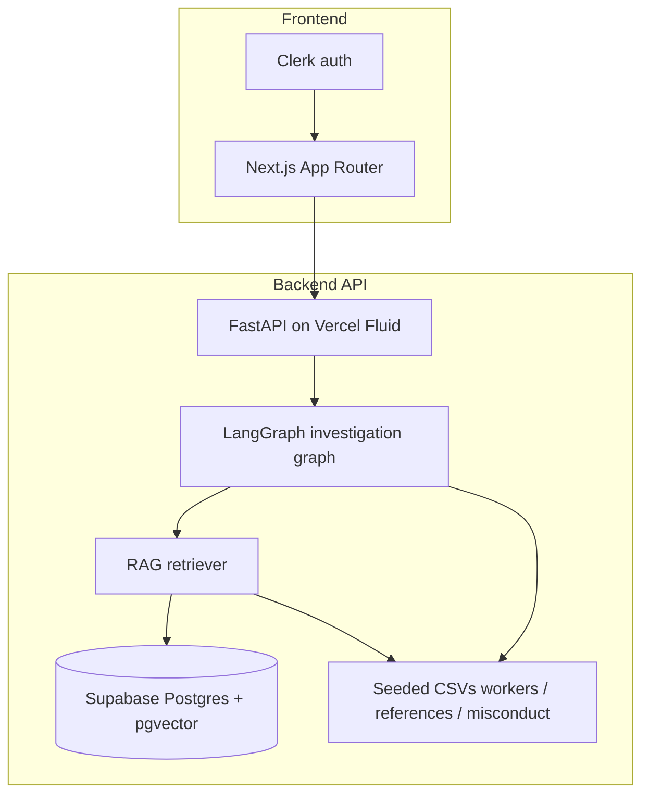

# SafeHire AI Risk Investigator

Evidence-grounded decision support for domestic-worker background checks. The stack combines **structured CSV profiles**, **Supabase + pgvector RAG** (with CSV fallbacks), **deterministic risk scoring**, **LangGraph** orchestration, and **LLM** narrative reporting so hiring teams see *what is known*, *what is uncertain*, and *what to review next*.

## Architecture



| Layer | Role |
|--------|------|
| **Frontend** | Next.js dashboard: worker selection, pipeline status, risk cards, markdown report, **per-worker follow-up Q&A**, and **platform-wide RAG** (questions across all workers). |
| **Backend** | FastAPI: `POST /investigate`, `POST /ask` (optional `worker_id` for platform questions), eval hooks, health. |
| **Orchestration** | LangGraph loads profile → retrieves evidence → signals → sufficiency → report. |
| **Retrieval** | `match_worker_documents` (per worker) and optional `match_platform_documents` (all workers); **CSV keyword fallback** if the platform RPC is missing or empty. |
| **Data** | `backend/app/data/*.csv` for demo workers; Supabase `worker_documents` for embeddings when ingested. |

SQL for the cross-worker RPC lives in [`backend/sql/match_platform_documents.sql`](backend/sql/match_platform_documents.sql). Run it in the Supabase SQL editor after your `worker_documents.embedding` column matches the embedding size (default **1536** for `text-embedding-3-small`).

## How to run locally

### Backend

```bash
cd backend
python -m venv .venv && source .venv/bin/activate   # Windows: .venv\Scripts\activate
pip install -r requirements.txt
cp .env.example .env   # if present; else create .env with keys below
uvicorn app.main:app --reload --host 0.0.0.0 --port 8000
```

Useful environment variables (see `backend/.env` as a template):

- `OPENAI_API_KEY` — embeddings + optional ask/report models  
- `SUPABASE_URL`, `SUPABASE_ANON_KEY` — vector search (strip to `https://<ref>.supabase.co` only)  
- `LANGCHAIN_API_KEY` / LangSmith — optional tracing  

API base for the UI is usually `http://localhost:8000/api` (set `NEXT_PUBLIC_API_BASE_URL` accordingly).

### Frontend

```bash
cd frontend
npm install
# .env.local
echo "NEXT_PUBLIC_API_BASE_URL=http://localhost:8000/api" >> .env.local
# Add Clerk keys from the Clerk dashboard
npm run dev
```

Open `http://localhost:3000`, sign in, then use the dashboard.

## How to demo

1. **Platform question** — On the dashboard, open **“Ask across all workers”** and try: *“Which worker is good with children?”* With seeded CSVs, evidence should surface **W001** (Mary) and contrasting rows where applicable. With Supabase + `match_platform_documents` deployed, answers follow vector similarity across ingested docs.  
2. **Per-worker investigation** — Pick a worker, **Run risk assessment**, then use **Follow-up Q&A** for worker-scoped questions.  
3. **Evals** — `GET /api/eval/summary` and `POST /api/eval/run` (longer) exercise the evaluation harness when wired.

## Tests & coverage

```bash
cd backend
source .venv/bin/activate
pytest tests/ -v
pytest tests/ --cov=app --cov-report=term-missing
```

Tests live under [`backend/tests/`](backend/tests/) (orchestrator, risk scorer, sufficiency, platform Q&A). Add `pytest-cov` output to CI as needed.

## Deployment

Production deploys are intended for **Vercel** via GitHub Actions:

| Workflow | Path | Notes |
|----------|------|--------|
| [`.github/workflows/deploy-backend.yml`](.github/workflows/deploy-backend.yml) | `backend/**`, `api/**`, … | Requires `VERCEL_TOKEN`, `VERCEL_ORG_ID`, `VERCEL_BACKEND_PROJECT_ID`. |
| [`frontend/.github/workflows/deploy-frontend.yml`](frontend/.github/workflows/deploy-frontend.yml) | `frontend/**` | Requires `VERCEL_TOKEN`, `VERCEL_ORG_ID`, `VERCEL_FRONTEND_PROJECT_ID`. |

Set your real URLs in the Vercel project:

- **Frontend**: `NEXT_PUBLIC_API_BASE_URL` → production API prefix (e.g. `https://<backend>.vercel.app/api`).  
- **Backend**: `CORS_ORIGINS`, `OPENAI_API_KEY`, Supabase keys, etc.

Replace the following placeholders with your team’s live links after the first successful deploy:

- **Frontend app:** `https://YOUR-FRONTEND.vercel.app`  
- **Backend API:** `https://YOUR-BACKEND.vercel.app`  

## License / status

Prototype / demo quality — not legal advice. Validate outputs and policies before production hiring decisions.
